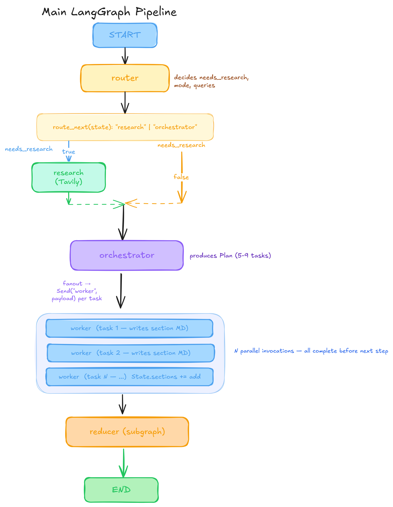

# Blog Writing Agent

An AI-powered blog writing system that generates complete technical blog posts from a topic. Built with **LangGraph**, the agent plans content, optionally performs web research, writes sections in parallel, and can add AI-generated images.

## Features

- **Topic-driven generation** — Enter a topic and get a full blog post with title, sections, and optional images
- **Smart routing** — Automatically decides whether web research is needed based on topic type:
  - **Closed book** — Evergreen concepts (no research)
  - **Hybrid** — Evergreen content with up-to-date examples (research + citations)
  - **Open book** — Weekly/news roundups (research-heavy, recency-filtered)
- **Web research** — Integrates [Tavily](https://tavily.com) for real-time search when needed
- **Parallel section writing** — Fan-out workers write each section concurrently for faster generation
- **AI-generated images** — Uses Google Gemini to create diagrams and illustrations (max 3 per blog)
- **Streamlit UI** — Simple web interface to generate, preview, and download blogs

## Architecture

The pipeline is implemented as a LangGraph state machine in `bwa_backend.py`. The Streamlit UI in `bwa_frontend.py` invokes the compiled graph (`app.stream()` / `app.invoke()`).




### Node descriptions

| Node | Role |
|------|------|
| **Router** | Decides `needs_research` and mode (closed_book / hybrid / open_book); outputs search queries when research is needed |
| **Research** | Runs Tavily search; synthesizes raw results into `EvidenceItem`s; filters by recency for open_book |
| **Orchestrator** | Produces a `Plan` with 5–9 tasks (goal, bullets, target words, tags, requires_citations, etc.) |
| **Workers** | Fan-out: each task runs in parallel; writes one section in Markdown with citations when required |
| **merge_content** | Concatenates sections in task order; adds title and structure |
| **decide_images** | LLM chooses 0–3 images; inserts placeholders (`[[IMAGE_1]]`, etc.) and image specs |
| **generate_and_place_images** | Calls Gemini to generate images; saves to `images/`; replaces placeholders with Markdown |

## Project Structure

```
blog-writing-agent/
├── bwa_backend.py       # LangGraph pipeline (router, research, orchestrator, workers, reducer)
├── bwa_frontend.py      # Streamlit UI
├── 1_bwa_basic.ipynb    # Basic LangGraph setup
├── 2_bwa_improved_prompting.ipynb
├── 3_bwa_research.ipynb
├── 4_bwa_research_fine_tuned.ipynb
├── 5_bwa_image.ipynb    # Image generation flow
└── tavily_test.ipynb
```

## Setup

### 1. Create a virtual environment (recommended)

```bash
python -m venv venv
# Windows
venv\Scripts\activate
# macOS/Linux
source venv/bin/activate
```

### 2. Install dependencies

```bash
pip install -r requirements.txt
```

### 3. Environment variables

Create a `.env` file in the project root:

```env
# Required for LLM calls
OPENAI_API_KEY=your_openai_key

# Optional: for web research (Tavily)
TAVILY_API_KEY=your_tavily_key

# Optional: for AI-generated images (Google Gemini)
GOOGLE_API_KEY=your_google_key
```

- **OPENAI_API_KEY** — Required. Used for planning, writing, and image decisions (GPT-4.1-mini).
- **TAVILY_API_KEY** — Optional. Enables research for hybrid/open_book topics. Without it, research returns empty evidence.
- **GOOGLE_API_KEY** — Optional. Enables image generation via Gemini 2.5 Flash. Without it, images are skipped and placeholders may remain.

## Usage

### Run the Streamlit app

```bash
streamlit run bwa_frontend.py
```

Then open the URL shown in the terminal (typically http://localhost:8501).

### Workflow

1. Enter a **topic** in the sidebar (e.g., "How attention works in Transformers")
2. Optionally set an **as-of date** for recency-sensitive content
3. Click **Generate Blog**
4. Browse the tabs:
   - **Plan** — Title, audience, tone, tasks
   - **Evidence** — Research sources (if used)
   - **Markdown Preview** — Rendered blog with local images
   - **Images** — Generated image specs and files
   - **Logs** — Graph execution events
5. Download:
   - **Download Markdown** — `.md` file only
   - **Download Bundle** — `.md` + `images/` as a zip

### Load past blogs

Saved `.md` files in the project directory appear under **Past blogs**. Select one and click **Load selected blog** to view it in the preview tab.

## Requirements

- Python 3.10+
- See `requirements.txt` for package versions

## License

MIT
